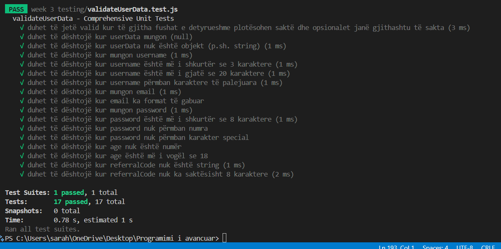
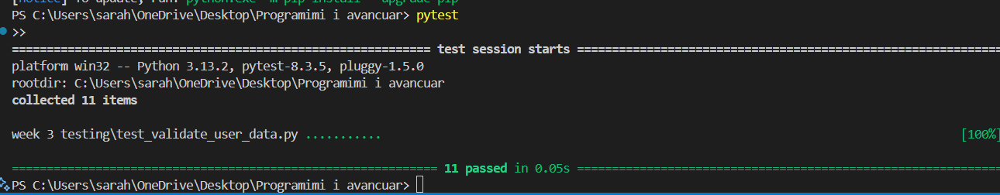

1.How effective was the AI at generating tests? What did it do well and what did it miss?
2.What strategies did you use to improve the AI-generated tests?
3.How would you use AI-assisted testing in real-world development?
4.What are the limitations and potential risks of relying on AI for test generation?

Using AI to generate test cases was a highly useful and efficient experience. The AI was able to create a comprehensive testing structure for the `validate_user_data` function, covering many common validation scenarios, such as missing required fields, incorrect email formats, and weak passwords. This saved time and allowed me to focus on analyzing and improving the tests rather than writing them from scratch.

However, the AI did not cover all edge cases. For instance, the initial tests lacked cases for boundary conditions, such as a `username` with exactly 3 or 20 characters, a `password` with exactly 8 characters, or a `referral_code` with different types of characters. Additionally, the structure of the initial tests was not fully organized, so I had to group them based on the different fields being tested.

To improve the AI-generated tests, I used several strategies, including:
- **Manually reviewing and adding tests for edge cases.**
- **Using `pytest` to ensure clear and easy execution of the tests.**
- **Organizing the test cases into categories (username, email, password, etc.) for better readability and maintainability.**

In a real-world development environment, AI-assisted testing would be highly valuable for generating an initial test suite, improving efficiency, and saving developers’ time. AI can also assist in maintaining tests when the code logic changes by suggesting new tests based on recent modifications.

However, there are some limitations and risks associated with relying solely on AI for test generation. AI may not fully understand all the unique edge cases of a specific application and could overlook critical scenarios. Additionally, it may generate redundant or unnecessary tests. For this reason, AI-generated tests should always be manually reviewed and refined to ensure they align with the project's requirements.

Overall, AI is a powerful tool for software testing, but it should not replace human expertise. Combining AI with manual review and enhancement provides a more robust and reliable strategy for testing applications. 

Screenshots of  the tests:

JS test screenshoot:

Python test screenshot:

