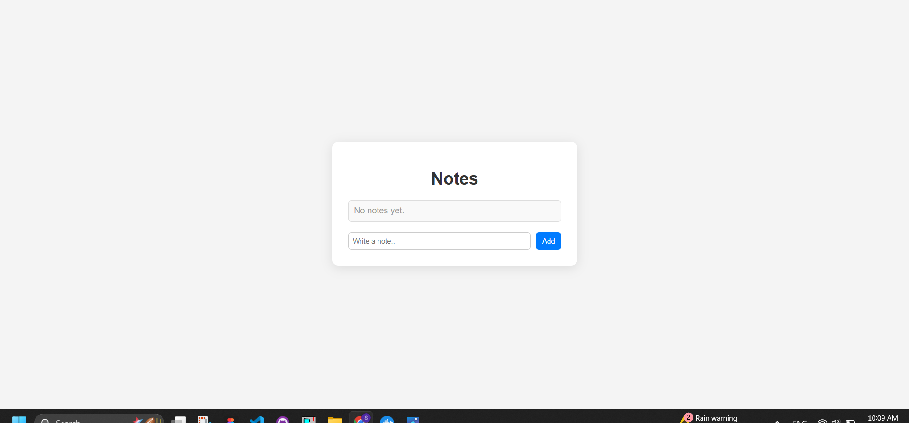
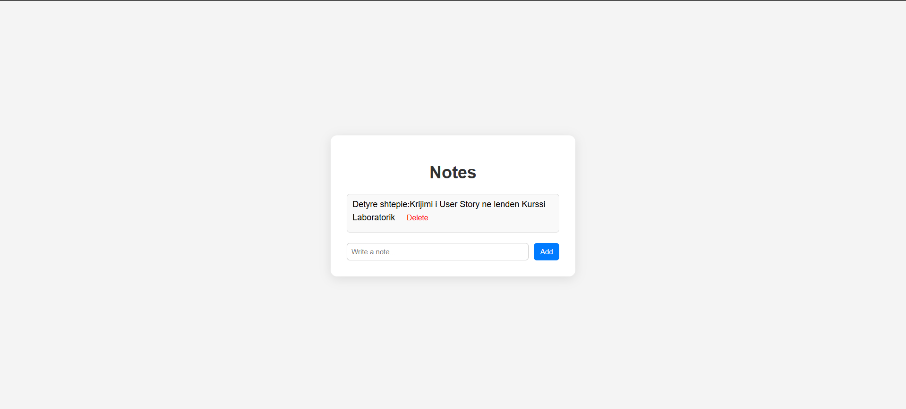

#  Notes App – Full Stack Mini Project with Docker Compose

A simple full-stack web app to create and view notes, built using Node.js (Express), MySQL, and a minimal HTML + JavaScript frontend. All components are containerized with Docker Compose.

---

##  Features

- ✅ REST API (GET, POST, DELETE)
- ✅ MySQL database with Docker volume
- ✅ Ultra-basic but responsive frontend
- ✅ Animations and delete buttons
- ✅ All runs with `docker compose up`

---

##  Stack

- **Backend:** Node.js, Express
- **Database:** MySQL (Dockerized)
- **Frontend:** HTML, CSS, JS
- **Docker:** Dockerfile + docker-compose

---

##  Project Structure

week7/
│
├── backend/
│   ├── Dockerfile
│   ├── index.js
│   ├── db.js
│   ├── init.sql
│   └── package.json
│
├── frontend/
│   ├── index.html
│   └── script.js
│
├── docker-compose.yml
└── README.md

## API Endpoints

Method	Endpoint	Description
GET	/notes	Get all notes
POST	/notes	Creates new note
DELETE	/notes/:id	Delete a note with an ID

## Screenshot

